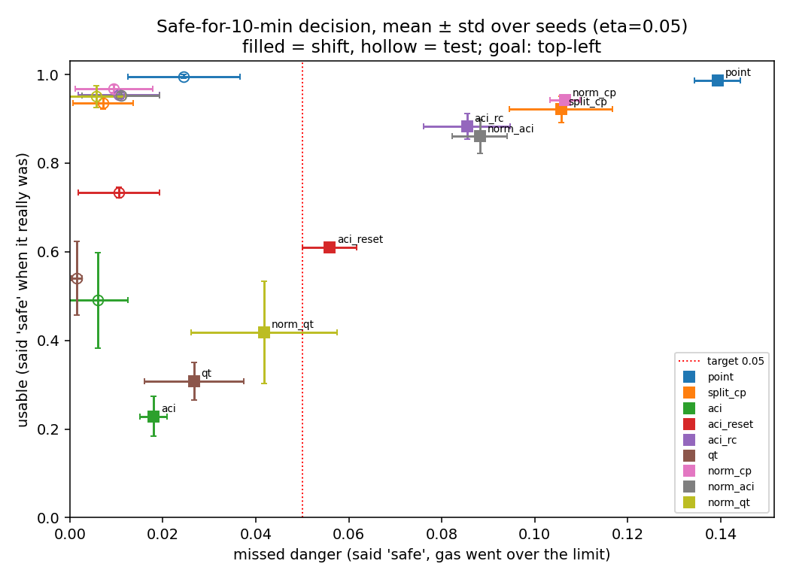

# Conformal safe-entry forecasting for toxic gas in manholes

Workers in India still enter sewers and manholes, and toxic gas kills them every year.
Gas detectors, including those on sewer-cleaning robots, report the gas level **now**.
They do not say whether the air will **stay** safe for the next 10 or 20 minutes,
which is what matters once someone is inside and sludge is being disturbed.

This repository forecasts H₂S at a worker's breathing height and turns the forecast into a
decision with a statistical guarantee:

> **"Safe for the next H minutes"** is declared only if a conformal upper bound on the
> maximum gas level over those H minutes stays below the exposure limit.

If the bound holds with probability at least 1 − α, then the robot says "safe" while the gas
actually exceeds the limit at most α of the time.

**Exposure limit:** 10 ppm, the NIOSH Recommended Exposure Limit for H₂S, which is a 10-minute
ceiling ([OSHA hydrogen sulfide standards page](https://www.osha.gov/hydrogen-sulfide/standards)).
A ceiling fits this study because the decision bounds the *maximum* concentration over the next
H minutes. A stricter 5 ppm limit (ACGIH STEL) is reported as a sensitivity check below.

**Status:** simulation study. No real gas or hardware was used.

## Main result

Target: at most 5% missed danger (α = 0.05). Shift = larger and more frequent gas bursts plus
more sensor drift than anything seen during calibration. Mean ± std over 3 seeds.

| Horizon | Split conformal: missed | ACI: missed / usable | **Burst-aware score + quantile tracking: missed / usable** |
|---|---|---|---|
| 5 min  | 6.0%  | 0.9% / 33% | **2.3% / 62%** |
| 10 min | 10.6% | 1.8% / 23% | **4.2 ± 1.6% / 42 ± 12%** |
| 20 min | 17.4% | 1.4% / 17% | **4.6 ± 0.6% / 26 ± 7%** |

- **missed** = said "safe", but the gas went over the limit within the horizon.
- **usable** = said "safe" when the air really stayed safe.

Findings:
1. Point forecasts miss up to a quarter of dangerous moments under shift, because gas bursts
   cannot be predicted before they start.
2. Static (split) conformal bounds lose their guarantee under shift.
3. Adaptive conformal inference (ACI) keeps the guarantee but says "unsafe" most of the time:
   after a few misses its bound jumps to infinity and stays there.
4. The obvious fixes (resetting or clipping ACI per manhole) quietly break the safety target.
5. A burst-aware normalised score combined with quantile tracking keeps missed danger below
   5% on average while being about 1.5 to 2 times more usable than ACI.
6. The adaptation step size cannot be tuned on normal-condition data: tuning on the test split
   picks the slowest step, which misses 5.2% under shift. The reported step (η = 0.05) was fixed
   in advance.



### Sensitivity: stricter 5 ppm limit (ACGIH STEL)

Same data and forecasts, only the decision threshold changes. Shift split, mean ± std over 3 seeds.

| Horizon | Split conformal: missed | ACI: missed / usable | Burst-aware + quantile tracking: missed / usable |
|---|---|---|---|
| 5 min  | 4.8%  | 1.2% / 31% | 1.6% / 46% |
| 10 min | 8.7%  | 1.9% / 22% | 2.1% / 26% |
| 20 min | 13.7% | 1.2% / 17% | 1.8% / 15% |

At 5 ppm the safety ranking holds (split conformal still fails), but the usefulness advantage
over ACI mostly disappears beyond 5 minutes: with a tighter limit, almost any bound that accounts
for bursts says "unsafe" most of the time. Usefulness gains depend on the limit used.

To reproduce: `$env:H2S_LIMIT_PPM = "5"` in PowerShell, then rerun the scripts.

## How it works

| Step | Script | What it does |
|---|---|---|
| 1 | `manhole_sim.py` | 1-D finite-volume model of H₂S building up in a 3 m manhole shaft after the lid is opened, with random gas bursts from disturbed sludge. Three noisy, lagged, drifting sensors at 0.3, 1.5 and 2.7 m. 300 normal scenarios + 100 shift scenarios. |
| 2 | `forecast.py` | Forecasts the true breathing-zone level 1 to 20 minutes ahead from the last 5 minutes of sensor data. Persistence, gradient boosting and LSTM. |
| 3 | `conformal.py` | Conformal upper bound on the maximum over the next 5, 10 and 20 minutes; split, Mondrian, trajectory-level and ACI variants. |
| 4 | `week4_adaptive.py` | Adaptive variants: ACI with reset or clipping, quantile tracking, burst-aware normalised scores. |
| 5 | `run_seeds.py` | Runs the whole pipeline for several seeds and step sizes; reports mean ± std. |

## Run it

Python 3.10 or newer.

```
pip install -r requirements.txt
python manhole_sim.py --selftest      # numerical checks: mass conservation, decay, analytic steady state
python manhole_sim.py                 # data/                  (~15 s)
python forecast.py                    # results_week2/         (~1-2 min on CPU)
python conformal.py                   # results_week3/
python week4_adaptive.py              # results_week4/
python run_seeds.py                   # runs/  all seeds       (~10-15 min)
```

The exact versions used for the reported numbers are in `requirements_exact.txt`.
Small differences (a few tenths of a percent) between machines come from library versions.

## Limitations

- **Synthetic data.** Physical parameters (mixing, ventilation, release rates) are plausible
  ranges, not measured values. The simulator is 1-D; real manholes are 3-D.
- The 10 ppm limit is a US NIOSH recommendation. Indian law (Factories Act, Second Schedule)
  sets 10 ppm as an 8-hour average and 15 ppm as a 15-minute short-term limit, which are not
  ceilings; a ceiling is used here because it is the conservative choice for a peak-based decision.
- The forecaster is trained and tested on the same simulator family.
- The window-level guarantee is approximate, because windows within one manhole are correlated.
  The trajectory-level variant in `conformal.py` gives a guarantee over whole scenarios.
- At 10 minutes, missed danger is below 5% on average but above it for some seeds.
- **This is research code, not a safety device.** Do not use it to decide whether anyone enters a
  confined space.

## Next steps

Validation against a 3-D gas-dispersion simulator, a ROS 2 / Gazebo probe demo, and a low-cost
sensor prototype tested with safe gases in a sealed box.

## Citation

See `CITATION.cff`.

Irene Boruah, Dibrugarh University Institute of Engineering and Technology, India.
ORCID [0009-0000-2094-8251](https://orcid.org/0009-0000-2094-8251)

## License

MIT
